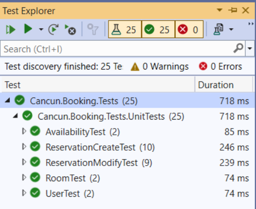

# Introduction 
This project was developed for the Alten Canada selection process and its main objective is to show my technical knowledge, using good programming practices to build an API with .NET.

# Getting Started
The API project was built using .NET Core 6, the default "Web API" template and test project was created using the "xUnit Test Project" template  in Visual Studio 2022.

To run, debug and change this project, you will need .NET SDK 6.0 and 7.0.

Below there is a list of the main libraries utilized:
1.	Swagger
2.	EFCore
3.	NewtonsoftJson
4.	AutoMapper
5.	FluentValidation 
6. 	xUnit and Moq

**Note:** For testing purposes, EntityFrameworkCore.InMemory was utilized. Database will be reset every time you run the application.

# Design 

**DDD (Domain Driven Design)** - to build the architecture of this project, I used the DDD pattern, because the purpose of the application was to use business rules to define how services, objects and data get handled through the layers.

**Fluent Validation** - as there were many business rules to be applied to the model, I chose Fluent Validator to perform validations centrally and correctly display error messages. I could have used Data Annotations but as the rules were a bit more complex, fluent validation gave me easier options to create such custom validations.

**Code First Approach** - I chose this approach mainly for its ease of use with the InMemory Database, but also for its simplicity, speed of development, and expertise.

**Error Handling** - an Error Handling class together with the User Friendly Exception was added in order to make the messages clearer and easier to understand.

**Unit Tests** - unit tests were done in order to reduce the occurrence of bugs, in case there are changes in the code, it would be easier to perceive the impacts of that change.

Last but not least, I tried to apply good programming practices and object orientation aligned with the purposes of this project to avoid code repetition and code smells.

# Solution

Cancun.Booking.Api - contains startup methods, configuration, dependency injection and the exposed controllers with endpoints

______

Cancun.Booking.Domain - should contain business rules within the services, interfaces, contracts, entities, and other classes

______

Cancun.Booking.Repository - data access layer, contains the database context and repositories. Fake Seed classes were also included here to facilitate testing.

# Tests

